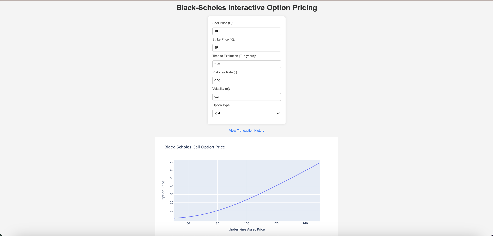
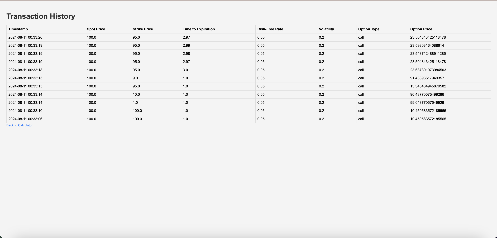

# Black-Scholes Option Pricing Visualizer

This Flask application provides an interactive visualizer for Black-Scholes option pricing, allowing users to input parameters and see real-time updates. The application also saves a history of all transactions (calculations) that users can view.

## Features

- **Interactive Black-Scholes Visualizer**: Update the graph in real-time as you change the input parameters.
- **Transaction History**: View a list of all past Black-Scholes calculations.
- **Real-Time Updates**: Powered by Flask-SocketIO for dynamic, real-time interaction.

## Prerequisites

- Python 3.7 or higher
- pip (Python package installer)
- Virtual environment management (optional but recommended)

## Installation

### 1. Clone the Repository

git clone https://github.com/harshilganapathi/black-scholes-visualizer
cd black-scholes-visualizer

### 2. Set Up a Virtual Environment

It’s recommended to use a virtual environment to manage dependencies. If you don’t have virtualenv installed, you can install it with pip:

pip install virtualenv

Create and activate a virtual environment:

For macOS/Linux:  
python3 -m venv venv  
source venv/bin/activate

For Windows:  
python -m venv venv  
.\venv\Scripts\activate

### 3. Install the Required Packages

Install all required Python packages using the requirements.txt file:

pip install -r requirements.txt

### 4. Set Up the Database

Initialize the SQLite database:

flask shell  
from app import db  
db.create_all()  
exit()

### 5. Run the Application

Start the Flask application:

python app.py

The application will be available at http://127.0.0.1:5000/ or http://localhost:5000/.

### 6. Access the Application

- Main Interface: Visit http://localhost:5000/ to use the Black-Scholes visualizer.
- Transaction History: Visit http://localhost:5000/history to view the history of all calculations.

## Screenshots

Here are some screenshots of the Black-Scholes Option Pricing Visualizer:

### Main Interface

### Transaction History

